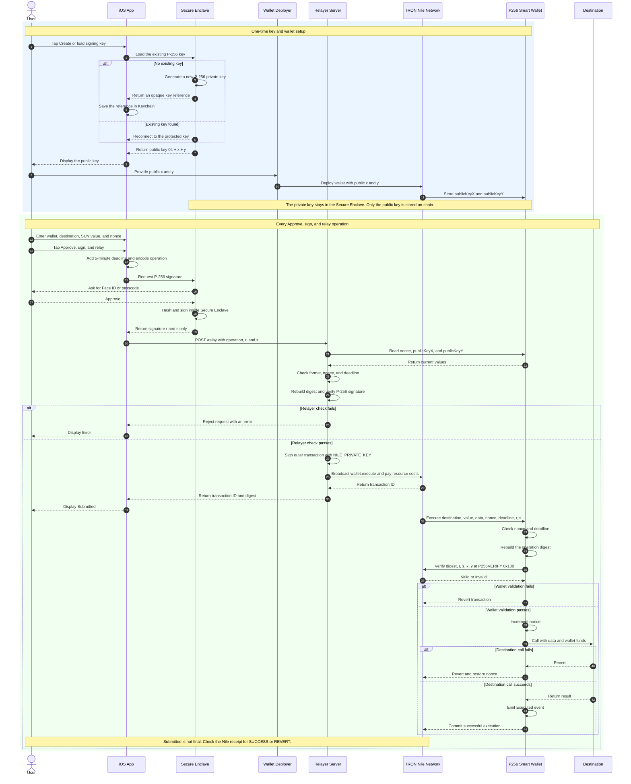

# TRON Nile P256VERIFY demo

An end-to-end, unaudited proof of concept for authorizing a TRON smart-contract wallet with an Apple Secure Enclave P-256 key. An ordinary Nile EOA relays the outer transaction; the wallet verifies the signed operation through TIP-7951 at `0x100` and executes it.

> **Demo only:** do not use these contracts or services with assets of real value. There is no recovery, key rotation, spend limit, relayer authentication, audit, or production hardening.

## Layout

```text
contracts/src/                 Solidity verifier probe and smart wallet
contracts/test/                Osaka/P-256 contract tests
protocol/operation.md          Canonical cross-language signed payload
relayer/src/                   Nile checker, deployment scripts, relay API
relayer/test/                  TypeScript digest and P-256 tests
ios/P256WalletDemo.xcodeproj   Xcode project
ios/P256WalletDemo/            SwiftUI app and Secure Enclave signer
ios/P256WalletDemoTests/       Shared digest-vector tests
```

## Local verification

Requirements: Node.js 22+, npm, and Foundry with Osaka support.

```bash
npm install
npm test
npm run build
forge test -vv
npm run nile:check
```

The contract tests execute the actual `0x100` precompile under Foundry's Osaka EVM. The TypeScript tests independently reproduce the shared digest and sign it without double hashing.

## P-256 keys in this project

Each wallet user has one P-256 key pair:

```text
Private key: one secret 32-byte number
Public key:  one curve point made from x (32 bytes) and y (32 bytes)
```

The `x` and `y` values are not two public keys. They are the two coordinates of one public key. Apple exposes that public key in uncompressed X9.63 form:

```text
04 || x || y
1B    32B  32B  = 65 bytes total
```

The leading `04` means "uncompressed public key." The iOS app displays this 65-byte public key after **Create or load signing key** is tapped. The public key is safe to display and share. For wallet deployment, remove the leading `04`, put the next 32 bytes in `P256_PUBLIC_KEY_X`, and put the last 32 bytes in `P256_PUBLIC_KEY_Y`.

On a physical iPhone, **Create or load signing key** does the following:

1. It looks in Keychain for an opaque reference to the app's existing Secure Enclave P-256 private key.
2. If the reference exists, CryptoKit reconnects to the same private key.
3. If it does not exist, the Secure Enclave generates a new private key and the app saves its opaque reference in Keychain.
4. The app derives and displays the corresponding public key. It never displays the private key.

The Secure Enclave private key cannot be exported by this app. `key.dataRepresentation` is an opaque reference used to find the protected key again; it is not the raw 32-byte private key. When the user approves an operation with Face ID or the device passcode, the operation enters the Secure Enclave, is signed there, and only the signature values `r` and `s` come back out:

```text
operation -> Secure Enclave private key -> signature (r, s)
                         private key stays inside
```

The smart-wallet contract stores only the public-key coordinates:

```solidity
bytes32 public immutable publicKeyX;
bytes32 public immutable publicKeyY;
```

It uses those public values to check that `(r, s)` was produced by the matching private key. The private key is never sent to the relayer or the contract and is not stored in this repository.

There is also a separate **relayer TRON EOA private key**, loaded from `NILE_PRIVATE_KEY`. The two private keys have different jobs:

| Key | Where it is kept | What it does |
| --- | --- | --- |
| User P-256 private key | iPhone Secure Enclave | Authorizes a smart-wallet operation and produces `(r, s)` |
| Relayer TRON private key | Relayer `.env` / process environment | Signs and pays for the outer TRON transaction |

The relayer cannot authorize a different wallet operation with its TRON key. It can only submit the operation that the user's P-256 key signed. On the Simulator, the app substitutes a temporary software P-256 private key held in process memory; this is for tests and does not demonstrate Secure Enclave protection.

## End-to-end flow

The swimlanes below show which actor performs each step. Time moves from top to bottom.



The two signatures in the flow serve different purposes:

```text
User P-256 signature (r, s)  -> proves the user approved this exact wallet operation
Relayer TRON signature       -> authorizes and pays for broadcasting the outer transaction
```

`Submitted` only means the relayer accepted and broadcast the transaction. The operation is complete only after the Nile receipt reports `SUCCESS`; a `REVERT` receipt means the wallet call did not take effect.

## Nile preparation

1. Create a brand-new test-only TRON account. Never reuse a mainnet private key.
2. Obtain test TRX from the [Nile faucet](https://nileex.io/join/getJoinPage).
3. Copy `.env.example` to `.env` and add the test-only key.
4. Run `npm run nile:check`; it must report `p256verifyActive: true`.
5. Build artifacts with `forge build`.

No command broadcasts by default. Both deployment scripts and the `/relay` endpoint require:

```text
CONFIRM_NILE_BROADCAST=I_UNDERSTAND
```

Do not set that value until you intentionally approve Nile transactions.

## Nile deployment

The verifier probe and P-256 wallet have been deployed on Nile. The probe at `TJWxpY7PCVVqPMdWbaKZ5ffPH6Xwo7XjN6` (`415dc27a9fe41bdca6b7e04a3476cf7fd31e0698a7`) returned `true` for the valid test vector and `false` for its tampered form, confirming that Nile executed the `P256VERIFY` precompile as expected.

The deployed wallet is:

```text
TRON Base58Check:  TPt83tvjrFjKTPTv8AEZEk4KabHvcEWVQV
TRON hex:          41989b8c5747943f0826396dbd7c57abc3b4b3ebb0
iOS/EVM-style:    0x989b8c5747943f0826396dbd7c57abc3b4b3ebb0
Initial nonce:     0
Funded balance:    999.999990 TRX (2026-08-24 snapshot after the 10 SUN transfer)
```

Do not copy a "current nonce" from this README; it changes after every successful operation. To get the latest value manually, open the [wallet on Nile TRONSCAN](https://nile.tronscan.org/#/contract/TPt83tvjrFjKTPTv8AEZEk4KabHvcEWVQV/code), select **Contract → Read Contract**, find the generated **nonce** method, and call it. Use the returned decimal value in the iOS **Wallet nonce** field immediately before signing.

A read-only post-deployment check confirmed that the wallet's `publicKeyX` and `publicKeyY` exactly match the P-256 public key generated by the installed iPhone app. The private key remains non-exportable in the iPhone Secure Enclave and is not stored in this repository.

The following deployment steps require explicit approval because they broadcast Nile transactions:

1. Deploy the probe:

   ```bash
   CONFIRM_NILE_BROADCAST=I_UNDERSTAND npm run nile:deploy:probe
   ```

2. Call the probe with the vector in `contracts/test/P256VerifyProbe.t.sol` using `npm run nile:test:probe -- <probe-address>`.
3. Generate/load the iPhone key and copy its X9.63 public key. Remove byte `04`; the first 32 bytes are `x` and the last 32 are `y`.
4. Add `P256_PUBLIC_KEY_X` and `P256_PUBLIC_KEY_Y` to `.env`, then deploy:

   ```bash
   CONFIRM_NILE_BROADCAST=I_UNDERSTAND npm run nile:deploy:wallet
   ```

5. Enter the deployed Base58Check wallet address directly in the iOS screen.

6. Before testing a nonzero value transfer, fund the deployed wallet with a small amount of Nile test TRX. The transfer value comes from the smart-wallet balance; the relayer account pays only the outer transaction's resource costs.

### Confirmed iPhone-to-Nile tests

The complete physical-iPhone flow has been exercised successfully. In each successful operation the iPhone Secure Enclave signed the canonical payload, the LAN relayer verified it, and the deployed wallet verified it through Nile's P-256 precompile before `execute` called `TQGfKPHs3AwiBT44ibkCU64u1G4ttojUXU` (`0x9cdeccbed8527dca387ee1116bc3915de88d714a`). The latest test used Base58Check addresses directly in the iOS UI and transferred a nonzero value.

| Operation nonce | Transaction | Result | Resulting nonce |
| --- | --- | --- | --- |
| `0` | [`78a1c339...49bdc68`](https://nile.tronscan.org/#/transaction/78a1c339a5851a6f23c6670475781c4bf6f388d68717c90e695cc6afd49bdc68) | `SUCCESS`, value `0` | `1` |
| `1` | [`2f44270a...2d9869`](https://nile.tronscan.org/#/transaction/2f44270acfdeb941ddb29ac809abd2be3ba52ebe5b49c426cd6dbbff142d9869) | `SUCCESS`, value `0` | `2` |
| `2` | [`897fdd0d...635790a`](https://nile.tronscan.org/#/transaction/897fdd0d270b58542425310e70442f8d0b8dea44005d3ad5d0050bcbd635790a) | `SUCCESS`, value `0` | `3` |
| `3` | [`a7157684...a1ed232`](https://nile.tronscan.org/#/transaction/a715768480b2886f51b4c865761b140afa634ed24d9f969c35d8907b5a1ed232) | `SUCCESS`, value `0` | `4` |
| `4` | [`7102003e...7d97874`](https://nile.tronscan.org/#/transaction/7102003eae07c317adccd636d6d932e7d1db73b98ddd51de1290920927d97874) | `SUCCESS`, value `10` SUN (`0.000010` TRX) | `5` |

Before the nonce-`4` operation, the wallet received `1,000` Nile TRX in [`d03bd237...855617`](https://nile.tronscan.org/#/transaction/d03bd23770956b6dc010184e1152e38d09ce0532f2a02272b6198b5f9f855617). The successful operation contains a non-rejected internal call with `call_value: 10` to the recipient, and the wallet balance became `999.999990` TRX. Values in the iOS app are denominated in SUN, so entering `10` sends ten SUN, not ten TRX.

An earlier operation, [`6064c43d...21702c`](https://nile.tronscan.org/#/transaction/6064c43dda9f6b2f0098133ad45a76719c6a4bfee2958ba21dcfdd649621702c), encoded `10,000,000` SUN (10 TRX) while the wallet was unfunded. It was included with result `REVERT`; no value moved and nonce `0` was not consumed. This demonstrates that a returned transaction ID means **submitted**, not necessarily successfully executed. Confirm the receipt result and updated on-chain nonce before treating an operation as complete.

## Relayer

The working Nile endpoint is:

```text
NILE_FULL_HOST=https://nile.trongrid.io
```

The previously used `https://api.nileex.io` endpoint repeatedly returned HTTP `503` from `wallet/broadcasttransaction`. The alternate Nile gateway above successfully handled the confirmed transactions.

The service binds only to localhost by default:

```bash
npm run relayer
curl http://127.0.0.1:8787/health
```

The relayer process and its Linux VM must remain running whenever the physical iPhone submits an operation. The app signs locally, but it sends the signed payload to `/relay`; if the relayer or VM is stopped, the app reports a connection/offline error and nothing is broadcast. After restarting the VM, start the relayer again with `npm run relayer`, re-check the bridged LAN address with `ip -brief address`, and update the app's relayer URL if DHCP assigned a different address.

For a physical iPhone on the same trusted LAN, set `RELAYER_HOST=0.0.0.0`, allow the port through the laptop firewall, and enter the laptop's LAN URL in the app. The endpoint still refuses broadcasts unless the confirmation variable is set.

If the relayer runs inside a virtual machine, a NAT-only address such as `10.0.2.15` is normally unreachable from the iPhone. Change the VM network adapter to **Bridged Adapter**, connect the host computer and iPhone to the same trusted Wi-Fi, restart the VM, and use its new LAN address as `http://<vm-lan-ip>:8787`. Do not expose this unauthenticated demo relayer to a public or untrusted network.

For the confirmed tests, the bridged VM address was `192.168.1.19`, making the relayer URL `http://192.168.1.19:8787`. This DHCP address may change after a reboot; re-check the VM's LAN address rather than treating it as permanent. Verify reachability from the iPhone in Safari with `http://<vm-lan-ip>:8787/health`.

`POST /relay` accepts decimal integers as strings and either TRON Base58Check or 20-byte hex addresses:

```json
{
  "wallet": "TBXSw8fM4jpQkGc6zZjsVABFpVN7UvXPdV",
  "destination": "TD5gsCwxykWsLN9aPrq2TAfNjByuZKYp4E",
  "valueSun": "1",
  "data": "0x",
  "nonce": "0",
  "deadline": "2000000000",
  "r": "0x...32 bytes...",
  "s": "0x...32 bytes..."
}
```

Before broadcasting, it fetches the wallet nonce and public key, checks the deadline, reconstructs the Nile-domain digest, and verifies the low-`s` P-256 signature locally. Read-only Nile calls are performed sequentially and retry transient `429`/`5xx` responses. Broadcasts are deliberately single-attempt because retrying an ambiguous broadcast response could submit the same signed transaction twice. If a broadcast response is ambiguous, query its transaction ID and the wallet nonce before retrying from the app.

## iOS app

The registered Apple configuration is:

```text
App name:       P256 Wallet Demo
Bundle ID:      com.aziz.p256walletdemo
Apple Team ID:  9AJKD9KA2B
Deployment:     iOS 17.0 or later
Distribution:   Internal TestFlight
```

The app includes an opaque 1024×1024 AppIcon asset and declares iPhone/iPad orientations required by App Store Connect. `OperationTests` must continue to match the Solidity and TypeScript digest vector.

On a physical iPhone, tap **Create or load signing key**. The opaque key representation is persisted in Keychain, signing requires Face ID or passcode user presence, and the private key never leaves the Secure Enclave. The Simulator substitutes an ephemeral software P-256 key and therefore does not prove Secure Enclave behavior.

The operation fields appear in this order:

1. **Relayer URL** — for example, `http://192.168.1.19:8787` on the confirmed LAN.
2. **Wallet address** — `TPt83tvjrFjKTPTv8AEZEk4KabHvcEWVQV` for this deployment.
3. **Destination address** — a TRON Base58Check address; the confirmed recipient was `TQGfKPHs3AwiBT44ibkCU64u1G4ttojUXU`.
4. **Value (SUN)** — a decimal SUN amount. `0` performs a zero-value call; `1 TRX = 1,000,000 SUN`, so `10,000,000` means 10 TRX.
5. **Wallet nonce** — must equal the current on-chain value. Open the [wallet on Nile TRONSCAN](https://nile.tronscan.org/#/contract/TPt83tvjrFjKTPTv8AEZEk4KabHvcEWVQV/code), select **Contract → Read Contract**, call **nonce**, and enter its result immediately before signing. Do not reuse a nonce from this README or an earlier transaction.

Both address fields require a valid TRON Base58Check address beginning with `T`. The app verifies the network prefix and checksum, then decodes the address for canonical digest construction.

Tap **Create or load signing key** first and confirm the status says **Secure Enclave key ready**. Use **Approve, sign, and relay** only after the relayer and Nile wallet are deliberately configured. The app's `Submitted` status reports relayer acceptance and a transaction ID; it does not currently poll the Nile receipt or prove successful execution.

The app passes the canonical encoded operation to CryptoKit, which hashes it once with SHA-256 while signing. It converts the signature to fixed-width `r || s` and normalizes `s` to the lower half-order. It never exports the private key.

### TestFlight from GitHub Actions

No local modern Mac is required. The manually triggered [iOS TestFlight workflow](.github/workflows/ios-testflight.yml) uses a GitHub-hosted macOS 26 runner with Xcode 26. It:

1. Checks out the repository.
2. Selects an available iPhone Simulator dynamically and runs the Swift unit tests without signing.
3. Installs the App Store Connect API key.
4. Creates a temporary macOS keychain and imports the Apple Distribution certificate.
5. Installs the `P256WalletDemo App Store` provisioning profile.
6. Archives a Release build with manual distribution signing.
7. Uses the GitHub run number as `CURRENT_PROJECT_VERSION`, ensuring every upload has a unique build number.
8. Exports and uploads the IPA to App Store Connect.
9. Deletes the temporary signing keychain even if the job fails.

The workflow has been exercised successfully through App Store Connect upload. Version `1.0`, builds `9` and `10`, reached **Testing** status in the `Personal Testing` internal group, which contains the physical-iPhone tester.

Configure these repository Actions secrets before running it:

```text
APP_STORE_CONNECT_ISSUER_ID
APP_STORE_CONNECT_KEY_ID
APP_STORE_CONNECT_PRIVATE_KEY
BUILD_CERTIFICATE_BASE64
BUILD_PROVISION_PROFILE_BASE64
P12_PASSWORD
```

Secret values must never be committed. Their meanings are:

- `APP_STORE_CONNECT_ISSUER_ID`: issuer ID shown under App Store Connect API team keys.
- `APP_STORE_CONNECT_KEY_ID`: ID of the API team key.
- `APP_STORE_CONNECT_PRIVATE_KEY`: complete contents of the one-time-download `AuthKey_*.p8` file.
- `BUILD_CERTIFICATE_BASE64`: single-line Base64 encoding of the password-protected Apple Distribution `.p12`.
- `BUILD_PROVISION_PROFILE_BASE64`: single-line Base64 encoding of the App Store `.mobileprovision` file.
- `P12_PASSWORD`: password used when exporting the `.p12`.

The `.p12` must use a format macOS Keychain can decode. With OpenSSL 3, export it using `-legacy`; otherwise `security import` may fail with `SecKeychainItemImport: Unable to decode the provided data`:

```bash
openssl pkcs12 -export -legacy \
  -inkey apple-distribution-private.key \
  -in distribution.pem \
  -out apple-distribution.p12 \
  -name "Apple Distribution"
```

Encode the signing files as single lines before copying them into GitHub Secrets:

```bash
openssl base64 -A -in apple-distribution.p12 \
  -out apple-distribution.p12.base64
openssl base64 -A -in P256WalletDemo_App_Store.mobileprovision \
  -out P256WalletDemo_App_Store.mobileprovision.base64
```

Start an upload from **GitHub → Actions → iOS TestFlight → Run workflow**. A successful job ends at **Complete job** without errors. Apple may take several minutes to process the uploaded build.

### Apple setup and signing assets

The working Apple-side setup is:

1. Register the explicit App ID `com.aziz.p256walletdemo` in Certificates, Identifiers & Profiles.
2. Create the matching iOS app record in App Store Connect.
3. Under **Users and Access → Integrations → App Store Connect API**, create an App Manager team key and download its `.p8` file once.
4. Generate a private key and CSR with OpenSSL; upload the CSR to create an **Apple Distribution** certificate.
5. Download the `.cer`, convert it to PEM, and combine it with the private key into the legacy-compatible password-protected `.p12`.
6. Create an **App Store Connect** distribution provisioning profile for `com.aziz.p256walletdemo`, using the Apple Distribution certificate. Its name must remain `P256WalletDemo App Store` unless `ios/ExportOptions.plist` is updated too.
7. Preserve the original certificate private key, `.p12` password, API `.p8`, and provisioning profile securely outside Git. The current certificate/profile expire with the Apple membership in August 2027 and must eventually be renewed.

### Enable an internal TestFlight build

After Apple finishes processing an upload:

1. Open **App Store Connect → P256 Wallet Demo → TestFlight**.
2. If the build shows **Missing Compliance**, select **Manage** and answer the export-compliance questionnaire according to the app's actual cryptographic behavior. This app calls standard P-256 and SHA-256 functionality supplied by Apple's CryptoKit/Secure Enclave and does not bundle a proprietary or standalone algorithm implementation; for the algorithm-type question, the completed setup selected **None of the algorithms mentioned above**.
3. Create the internal group `Personal Testing` and enable automatic distribution.
4. Confirm the processed build is present and shows **Ready to Test**.
5. Open the group's **Testers** tab, invite the App Store Connect account, and confirm the group shows one tester and one build.
6. On the physical iPhone, install Apple's TestFlight app, sign in with the same Apple Account, accept the invitation, and install P256 Wallet Demo.
7. For subsequent builds, open P256 Wallet Demo in TestFlight and tap **Update**. Do not delete the existing app first; an in-place update preserves the existing installation and its Secure Enclave/Keychain signing-key reference. After updating, tap **Create or load signing key** and confirm **Secure Enclave key ready** before signing another operation.

Internal TestFlight builds expire after 90 days. Running the workflow again creates a new build number and upload.

## Security and scope limitations

- A valid P-256 signature proves key possession, not that the key was generated by a Secure Enclave. App Attest would be separate.
- Losing the device can permanently lose wallet authority.
- The demo supports one immutable key and has no recovery or rotation.
- The relayer has no authentication, rate limiting, persistence, or abuse controls.
- The app reports submission, not finality; always inspect the Nile receipt for `SUCCESS` versus `REVERT` and confirm the resulting nonce.
- Local HTTP is allowed only to simplify LAN testing; use TLS for any non-local deployment.
- The iOS UI accepts TRON Base58Check addresses and decodes them to 20-byte EVM addresses for digest construction.
- The Nile chain ID is fixed at decimal `3448148188` (`0xcd8690dc`) in both the app and relayer.
