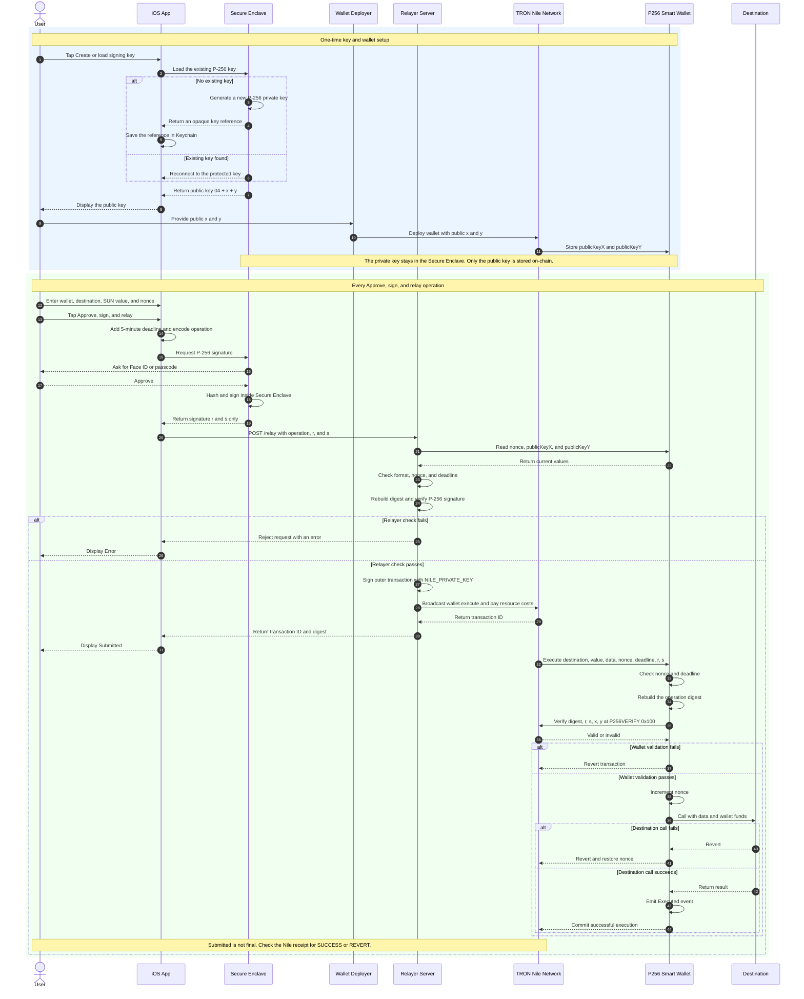

# Detailed end-to-end sequence

This diagram shows the one-time key and wallet setup followed by every step of an approved operation. Time moves from top to bottom.

The user P-256 signature proves approval of the exact wallet operation. The separate relayer TRON signature authorizes and pays for broadcasting the outer transaction. `Submitted` only means the transaction was broadcast; check the Nile receipt for `SUCCESS` or `REVERT`.
